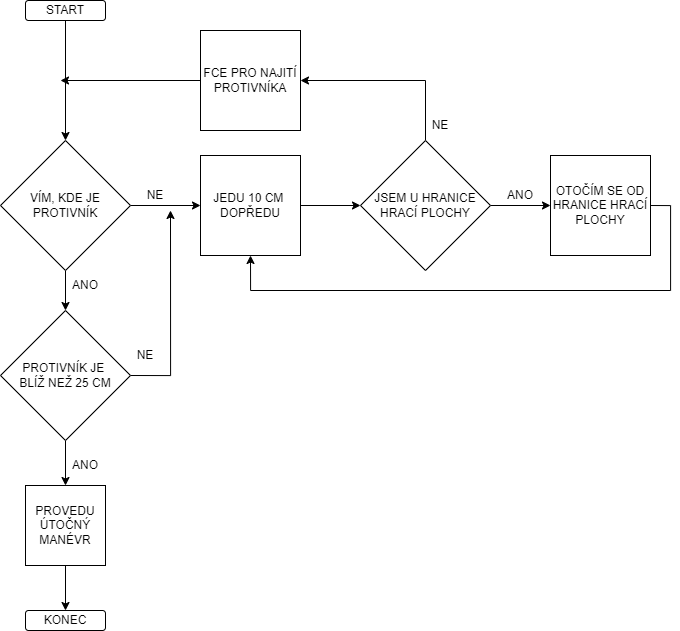
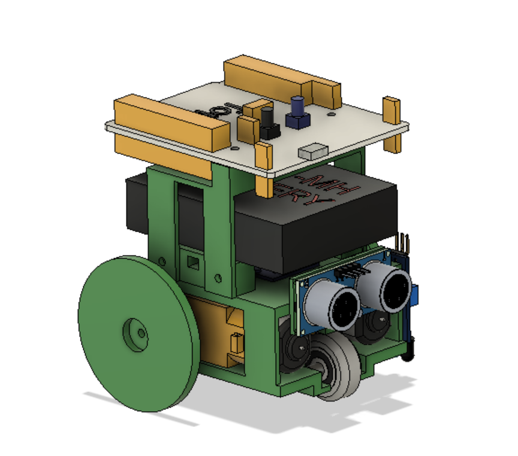

# mini_sumo_robot
Závěrečný MIT projekt Pana Kolduse a Pana Pleskiho, neboli mini sumo robot co nabije tomu od Lukáše a Karla ale i Petra a Martina zadek!
# vývojový diagram 

# 3D model vytvořený v programu Fusion 360

# Seznam použitých součástek
- Ultrazvukový senzor HC-SR04
- 2x Infračervený senzor FC-51
- H-můstek modul L9110S
- 2x TT motor s převodovkou
- Nikko baterie pro RC auta
- Stabilizátor napětí L7805
- STM8 Nucleo
- Vypínač
