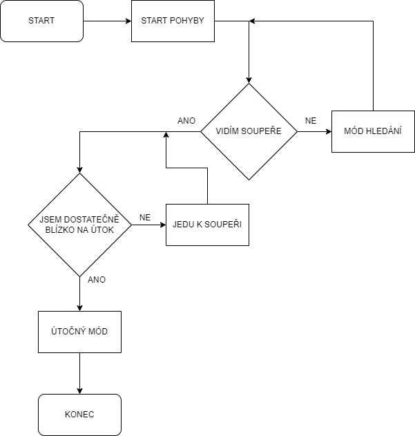
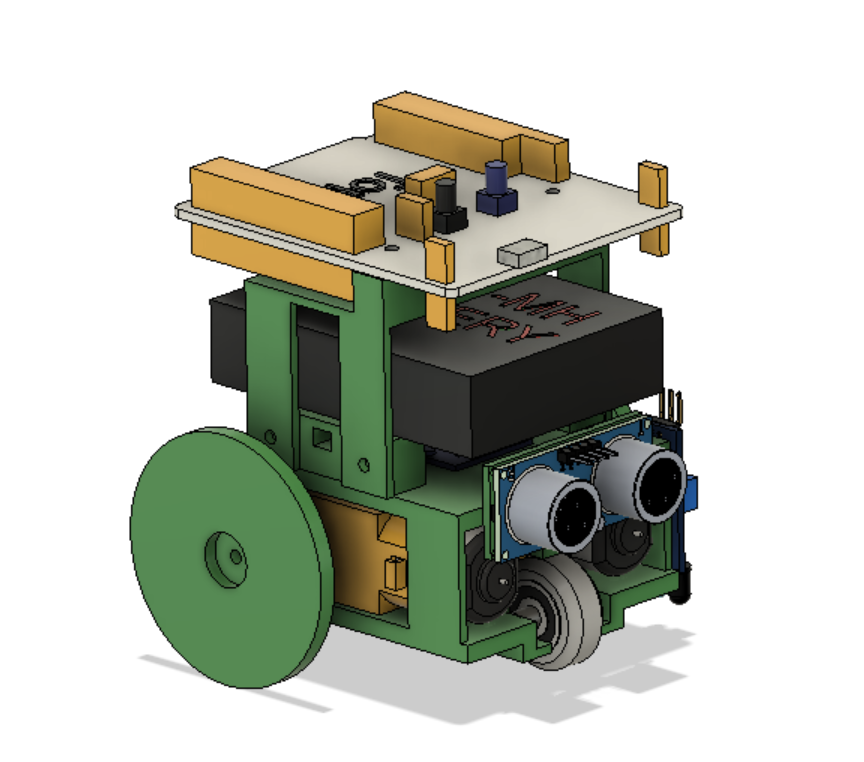
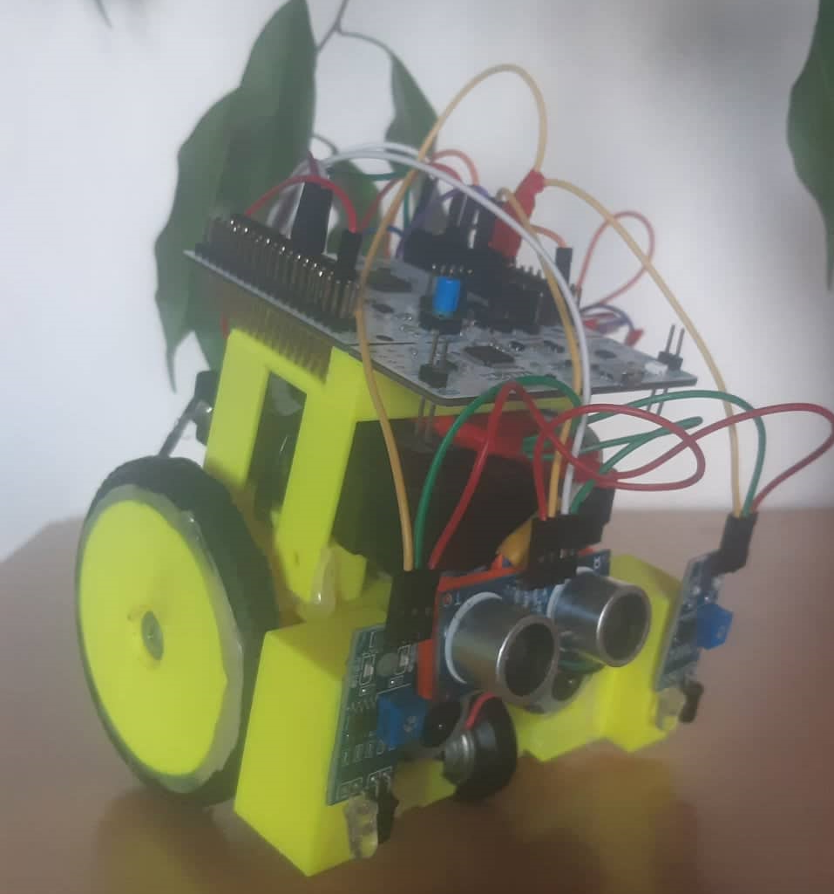
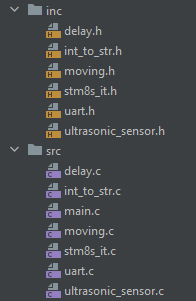

<h1 align="center"> Mini sumo robot </h1>
<p align="center">Závěrečný projekt Jiřího Koldy a Askolda Horčičky z MIT.</p>
<p align="center">(3.B, 2021/22)</p>

---
## Představení:

<p>Mini sumo je jednou z kategorií zápasení robotů. Cílem zápasení je vystrčit svého oponenta z arény,
jakýmkoli způsobem, robot ale musí splňovat podmínky dané kategorie, konktrétně v kategorii mini sumo 
to je velikost 10x10 cm (výška neomezena) a váha nesmí převišovat 500 g. Aréna pak má 70 cm v průměru.
</p>

---
## Vývojový diagram:


<p>Začali jsme návrhem, co by měl robot dělat, proto máme vývojový diagram, který nám to hodně zhruba
prozradí</p>

---
<p align="center"><p>

---

## Komponenty, modelávání, hardwarová část
### - Seznam použitých součástek
- Ultrazvukový senzor HC-SR04
- 2x Infračervený senzor FC-51
- H-můstek modul L9110S
- 2x TT motor s převodovkou
- Nikko baterie pro RC auta
- Stabilizátor napětí L7805
- STM8 Nucleo
- Vypínač

Následoval návrh komponent co budeme používat a sestavení robota, na fotce je 3D model robota vytvořený
v programu Fusion 360, tělo robota bylo vytištěno na 3D tiskárně. Jako pohon jsme vybraly dva TT motory
s převodovkou, pro obě postranní kola jeden, přední kolo není poháněno. Aby robot věděl o světě jsme použíli
dva infračervené senzory FC-51, které hlídají, aby robot nevyjel z arény a pak pro sledování vzdáleností a
hledání oponenta Ultrazvukový senzor HC-SR04. Motory jsou ovládány momocí H-můstku L9110S. Pohon zajišťují
znova nabitelná baterie se stabilizátorem napětí L7805.
<p align="center"><p>
<p align="center"><p>

---

## Propojení komponent, programová část
Robot je ovládán čistě pomocí  mikrokontroléru STM8, zapojili jsme několik vstupů a výstupů, ať už vstupy  pro
senzory čí výstupy pro ovládání H-můstku. Také jsme museli vyřešit celou logiku fungování robota. Robot snímá své
okolí pomocí ultrazvukového senzoru, podle vzdáleností a přítomnosti objektů jsme schopni vyhodnotit situaci a umístit
robota do určitého módu (hledání, k nepřítely, útok). Celou dobu přitom infračervené senzory kontrolují jestli náhodou
nevyjíždíme z arény, aby jsme nevyjeli z arény sami od sebe a tudíž neprohráli bez námahy oponenta.

### - Programování
Vytvořili jsme několik rozšiřujích souborů pro přehlednost main.c souboru, moving.c soubor je například plný
funkcí pro pohyb robota tudíž H-můstku. Následují ukázky kódu. Snažili jsme se dělat napříč kódem výstižné komentáře.
<p align="center"><p>


```c
void go_straight(uint16_t speed) 
{   // parameter range 0 - 4000 -> works well with over 800 -> the higher the faster
    GPIO_WriteLow(motor_driver_A1B_port, motor_driver_A1B_pin);
    GPIO_WriteLow(motor_driver_B1B_port, motor_driver_B1B_pin);

    TIM2_SetCompare1(speed);
    TIM2_SetCompare2(speed);
}
```
- Funkce v souboru movíng.c pro jízdu vpřed, rychlost jízdy je regulována pomocí PWM, parametr je tudíž rychlost.
  Rychlost můžeme nastavit od 0 do 4000 (určujeme hranici překlopení u PWM, 4000 je maximální výkon)

```c
    tim4_init();            // init timer 4 -> used for function delay_ms
    tim3_init();            // init timer 3 -> used for calculating distance with ultrasonic sensor
    tim2_init();            // init timer 2 -> used for PWM
    tim2_PWM_init();        // init timer 2 PWM chanels -> used for motor control
    motor_pins_init();      // init motor pins -> used for motor control
```
- Inicializace potřebných timerů, PWM a pinů motoru

```c
int tim3_get_distance(uint16_t tim3_value)
{
    uint16_t time_in_us = tim3_value/4; // devided timer value to get time in microseconds

    /* calculating distance in cm (0.034 -> speed of sound in the air - cm/us,
    devided by 2 cos we measured time to the object and back) */
    return ((time_in_us*0.034)/2);  
}
```
- Výpočet vzdálenosti podle hodnoty do které napočítal timer 3, pro pochopení je potřeba znát funkce pro
  ultrazvukový senzor

```c
// interrupt handler for right infrared sensor
INTERRUPT_HANDLER(EXTI_PORTE_IRQHandler,7)          // TODO find out the right moves, moves like jagger
{
disableInterrupts();                            // I need to disable interrupts cos of the delay
go_gay();
delay_ms(300);
rotate_left(2000);
delay_ms(200);
enableInterrupts();                             // enable interrupts back again
}
```

- Interrupt handler vyvolaný přejetím pravého infračerveného senzoru přes kraj arény. Jede o zpět a pak se
  pootočí.
---
## Závěr
Díky tomuto projektu jsme měli možnost se podrobně seznámit se součástkami ale i zabřenout do bažiny teda
krásných vod programovacího jazyka C, některé úvahy nad efektivnějším fungováním robota byly velice zajímavé.
Samozřejmě jsme na cestě narazili na spoustu problémů, nicméně se nám je podařilo všechny vyřešit, šlo o problémy
od upadajícího kolečka přes špatné kontakty po vyřešení měření délky pulzu z ultrazvukového senzoru. Nemám pochyby o
tom že náš robot zvítězí nejen při hodnocení ale i v aréně.